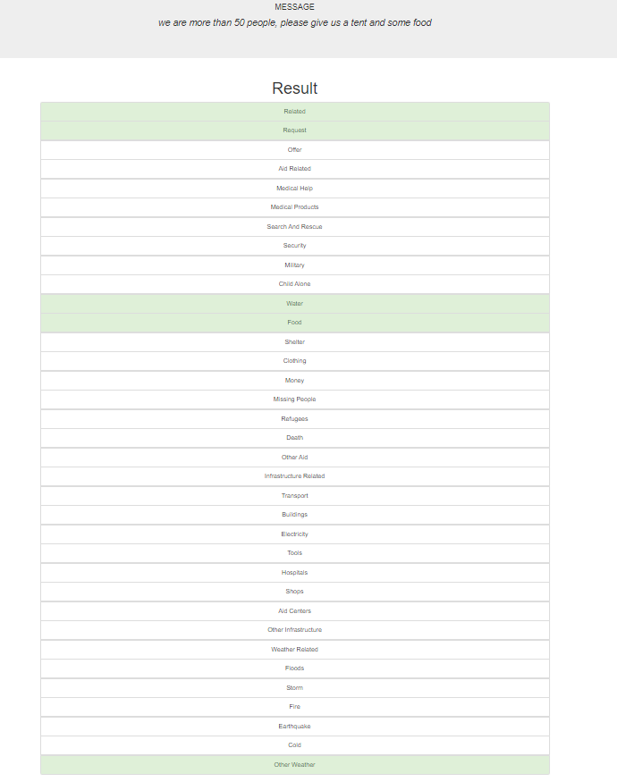

# Disaster-Management-udacity

This Project is part of Data Science Nanodegree Program by Udacity in collaboration with Figure Eight. The dataset contains pre-labelled tweet and messages from real-life disaster events. The project aim is to build a Natural Language Processing (NLP) model to categorize messages on a real time basis.

This project is divided in the following key sections:

Processing data, building an ETL pipeline to extract data from source, clean the data and save them in a SQLite DB
Build a machine learning pipeline to train the which can classify text message in various categories
Run a web app which can show model results in real time

Getting Started

Dependencies
Python 3.5+
Machine Learning Libraries: NumPy, SciPy, Pandas, Sciki-Learn
Natural Language Process Libraries: NLTK
SQLlite Database Libraqries: SQLalchemy
Model Loading and Saving Library: Pickle
Web App and Data Visualization: Flask, Plotly

How to run the program is in the workspace folder readme.

License
License: MIT

Acknowledgements
Udacity for providing an amazing Data Science Nanodegree Program
Figure Eight for providing the relevant dataset to train the model

# Disaster Response Pipeline Project

### Instructions:
1. Run the following commands in the project's root directory to set up your database and model.

    - To run ETL pipeline that cleans data and stores in database
        `python data/process_data.py data/disaster_messages.csv data/disaster_categories.csv data/DisasterResponse.db`
    - To run ML pipeline that trains classifier and saves
        `python models/train_classifier.py data/DisasterResponse.db models/classifier.pkl`

2. Run the following command in the app's directory to run your web app.
    `python run.py`

The ETL folder consists of preprocessing the data and storing it in the table before it is passed into the machine learning pipeline

